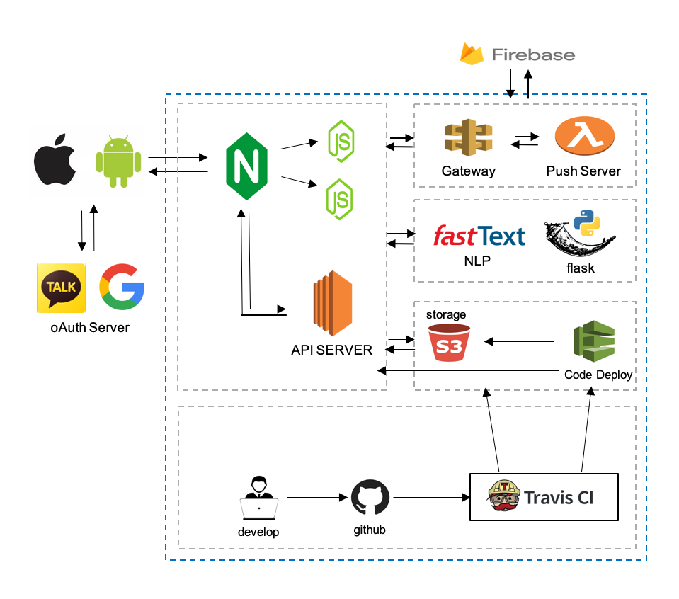

# WillSon-Server

고민 해결을 위한 상담 플랫폼입니다.

> ### 운영 환경

nvm => v0.33.11

Node.js => v9.11

Flask => v1.0.2

Mysql => v5.7

webpack => 4.35.0

FastText(natural language process)


> ### 실행환경

```shell
# yarn package install
$ npm install -g yarn 

# pm2 package install
$ npm install -g pm2

# npm package install
$ npm install

# project build
$ yarn build:dev

# project start
$ yarn start

```

> ### CI/CD 설정 및 설명

CI => Travis,
CD => Aws Code Deploy

중요 키 및 환경변수는 프로젝트의 Settings -> CI/CD 설정에 담겨있습니다.

CI 관련 설정은 .tarvis.yml, CD 관련 설정은 appspec.yml에 명세합니다.

 
> ### 운영 아키텍쳐



###
###

> ### 서비스 에러 코드
 
```java
  
  시스템 및 서비스 관련

  1: "DATABASE_ERROR",
  2: "NOT_AUTHENTICATION_ERROR",
  
  기능관련 오류 코드
  
  // 회원가입
  100: "SIGN_UP_SUCCESS",
  101: "SIGN_UP_DUPLICATE_DATA",
  102: "SIGN_UP_VALIDATION_ERROR",
  103: "SIGN_UP_ERROR_ANYWAY",

  // 로그인
  200: "SIGN_IN_SUCCESS",
  201: "SIGN_IN_VALIDATION_ERROR",
  202: "SIGN_IN_AUTHENTICATION_ERROR",
  203: "SIGN_IN_ERROR_ANYWAY",

  // 유저 프로필
  300: "GET_USER_PROFILE_LIST_SUCCESS",
  301: "USER_PROFILE_LIST_VALIDATION_ERROR",
  302: "USER_PROFILE_LIST_ERROR_ANYWAY",

  //  카테고리 리스트 
  400: "GET_CATEGORY_LIST_SUCCESS",
  401: "GET_CATEGORY_LIST_VALIDATION_ERROR",
  402: "GET_CATEGORY_LIST_ERROR_ANYWAY",

  // 카테고리 등록
  500: "POST_CATEGORY_LIST_SUCCESS",
  501: "POST_CATEGORY_LIST_VALIDATION_ERROR",
  502: "POST_CATEGORY_LIST_ERROR_ANYWAY",

  // 감정 리스트 출력
  600: "GET_FEELING_LIST_SUCCESS",
  601: "GET_FEELING_LIST_VALIDATION_ERROR",
  602: "GET_FEELING_LIST_ERROR_ANYWAY",

  // 질문 등록하기
  700: "POST_USER_QUESTION_SUCCESS",
  701: "POST_USER_QUESTION_VALIDATION_ERROR",
  702: "POST_USER_QUESTION_ERROR_ANYWAY",
  703: "POST_USER_QUESTION_INSERT_ERROR",

  // 질문 리스트 출력
  800: "GET_USER_QUESTION_LIST",
  801: "GET_USER_QUESTION_LIST_ERROR_ANYWAY",

  // 헬퍼 등록
  900: "HELPER_REGISTRATION_SUCCESS",
  901: "HELPER_REGISTRATION_VALIDATION_ERROR",
  902: "HELPER_REGISTRATION_ERROR_ANYWAY",

  //  헬퍼 리스트 출력
  1000: "GET_HELPER_LIST_SUCCESS",
  1001: "HELPER_LIST_QUESTION_DOES_NOT_EXIST",
  1002: "GET_HELPER_LIST_ERROR_ANYWAY",

  // 헬퍼 프로필 출력 
  1100: "GET_HELPER_PROFILE_SUCCESS",
  1101: "PROFILE_HELPER_DOES_NOT_EXIST",
  1102: "GET_HELPER_PROFILE_ERROR_ANYWAY",

  // 헬퍼 프로필 업데이트
  1200: "UPDATE_HELPER_PROFILE_SUCCESS",
  1201: "USER_IS_NOT_HELPER",
  1202: "UPDATE_HELPER_PROFILE_ERROR_ANYWAY",
  1203: "UPDATE_HELPER_PROFILE_VALIDATION_ERROR",

  // 메인 헬퍼 이야기
  1300: "GET_HELPER_STORY_SUCCESS",
  1301: "MISSING_HELPER_STORY",
  1302: "GET_HELPER_STORY_ERROR_ANYWAY",

  // 원하는 헬퍼 출력하기
  1400: "HELPER_SELECTION_SUCCESS",
  1401: "HELPER_SELECTION_QUESTION_DOES_NOT_EXIST",
  1402: "SELECTION_HELPER_DOES_NOT_EXIST",
  1403: "HELPER_SELECTION_ERROR_ANYWAY",
  1404: "HELPER_SELECTION_ALREADY_MATCHING",

  // 후기 리스트 출력
  1500: "GET_REVIEW_LIST_SUCCESS",
  1501: "USER_REVIEW_LIST_VALIDATION_ERROR",
  1502: "USER_REVIEW_LIST_ERROR_ANYWAY",

  // 리뷰 등록하기
  1600: "REVIEW_REGISTERED_SUCCESS",
  1601: "REVIEW_VALIDATION_ERROR",
  1602: "REVIEW_REGISTERED_ERROR_ANYWAY",

  // 후기 수정하기
  1700: "MODIFIED_REVIEW_SUCCESS",
  1701: "MODIFIED_REVIEW_VALIDATION_ERROR",
  1702: "MODIFIED_REVIEW_PERMISSION_ERROR",
  1703: "MODIFIED_REVIEW_ERROR_ANYWAY",

  // 성격 리스트 출력
  2000: "GET_PERSONALITY_LIST_SUCCESS",
  2001: "GET_PERSONALITY_LIST_VALIDATION_ERROR",
  2002: "GET_PERSONALITY_LIST_ERROR_ANYWAY",

  // 유저 선택하기
  2100: "USER_SELECTION_SUCCESS",
  2101: "USER_SELECTION_VALIDATION_ERROR",
  2102: "USER_SELECTION_ERROR_ANYWAY",

  // 질문 상태 변경
  2200: "UPDATE_USER_QUESTION_STATUS_SUCCESS",
  2201: "UPDATE_USER_QUESTION_VALIDATION_ERROR",
  2202: "UPDATE_USER_QUESTION_ERROR_ANYWAY",
  2203: "UPDATE_USER_QUESTION_NOT_FOUND",

  // 메인 후기 리스트
  2300: "GET_MAIN_REVIEW_LIST_SUCCESS",
  2301: "MAIN_REVIEW_LIST_ERROR_ANYWAY",

  // 헬퍼 등록 상태
  2400: "GET_HELPER_EXIST_CHECK_SUCCESS",
  2401: "GET_HELPER_EXIST_CHECK_ERROR_ANYWAY",
  
  // 헬퍼 프로필 정보 가져오기
  2500: "GET_HELPER_MYPROFILE_SUCCESS",
  2501: "MYPROFILE_HELPER_DOES_NOT_EXIST",
  2502: "GET_HELPER_MYPROFILE_ERROR_ANYWAY",

  // 질문자 - 헬퍼 매칭 상태 변경
  2600: "UPDATE_MATCHING_STATUS_SUCCESS",
  2601: "UPDATE_MATCHING_STATUS_ERROR_ANYWAY",
  2602: "UPDATE_MATCHING_STATUS_NOT_FOUND",
```
